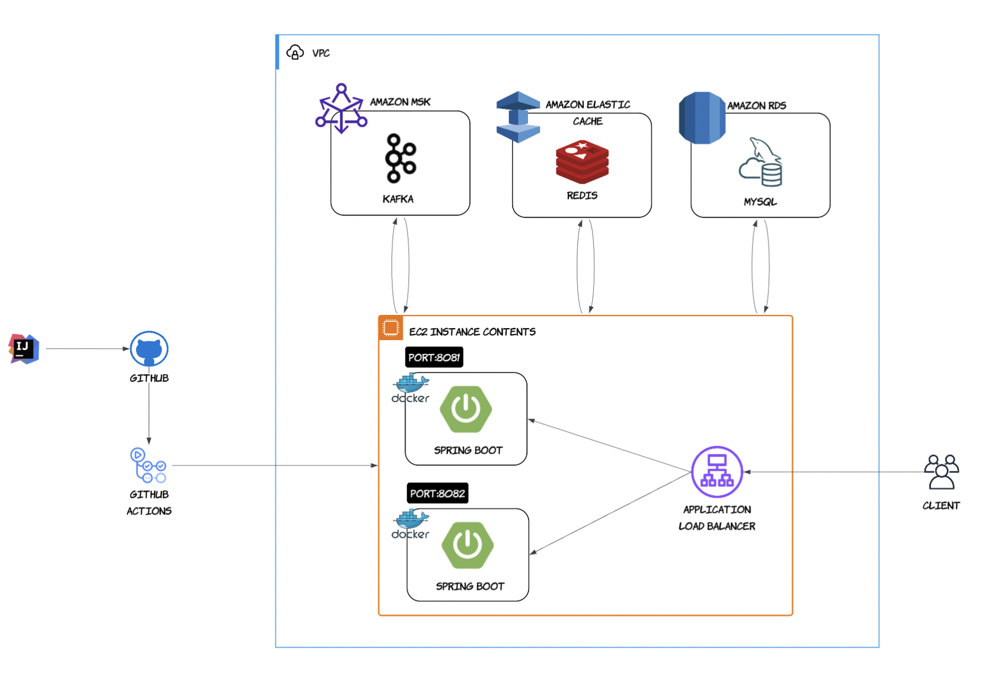
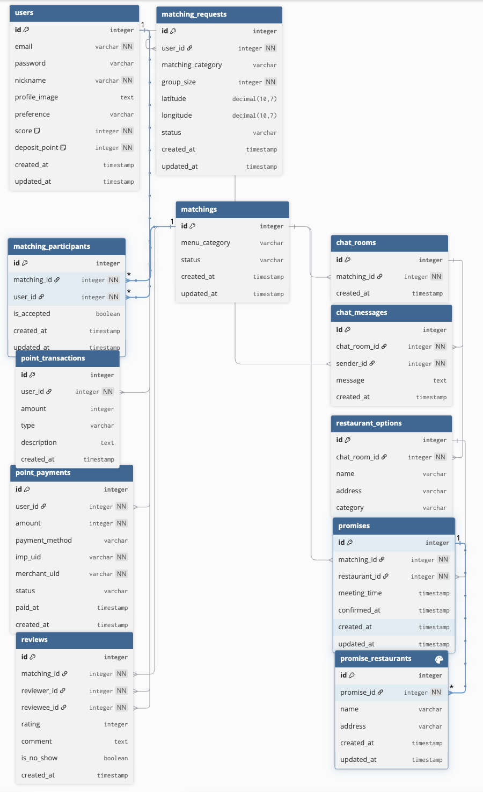

# 🍚 모각밥 (혼밥 매칭 플랫폼) 
* LOL(게임) 매칭 기능에서 착안하여, 사용자의 식사 성향과 위치 정보를 기반으로 식사 약속을 연결하는 실시간 매칭 서비스입니다.

---
## ✨ 주요 기능

➊ **회원가입 & 로그인 (소셜 연동)**
- 이메일/비밀번호, 소셜 로그인 지원 (깃허브 연동)  
- 기본 포인트(2000P), 신뢰 점수(50점) 제공  

➋ **매칭 참여**
- 2000P 사용해 매칭 참여  
- 성향(조용/대화) + 위치 기반 실시간 매칭  

➍ **채팅**
- 매칭 성사 시 전용 채팅방 자동 생성  
- 식당 제안 및 대화로 약속 준비  

➎ **약속 (Promise) 확정**
- 채팅에서 합의된 장소·시간으로 약속 확정  
- 참석 시 2000P 환급, 노쇼 시 환급 불가 → 신뢰도 보장  

➏ **후기 & 신뢰도 시스템**
- 모임 종료 후 별점 + 후기 작성 가능  
- 긍정적 참여 시 신뢰 점수 상승, 노쇼 시 점수 하락  
---
## 🛠 기술 스택

| 항목                       | 기술 스택                                                      |
| ------------------------ | ---------------------------------------------------------- |
| **Language & Framework** | Java 17, Spring Boot 3.3, Spring Data JPA, Spring Security |
| **Architecture**         | Layered Architecture (멀티 모듈)                             |
| **Database & Cache**     | MySQL 8.0, Redis                                           |
| **Message Queue**        | Apache Kafka                                               |
| **Build & CI/CD**        | Gradle, GitHub Actions                                     |
| **Infra & Deployment**   | AWS EC2, RDS, S3, Docker  ++추가 예정                           |
| **API & Docs**           | Swagger (OpenAPI 3)                                        |
| **Testing**              | JUnit5, Mockito                                            |

---
## 🏗 아키텍처

---

## 📂 ERD

---
