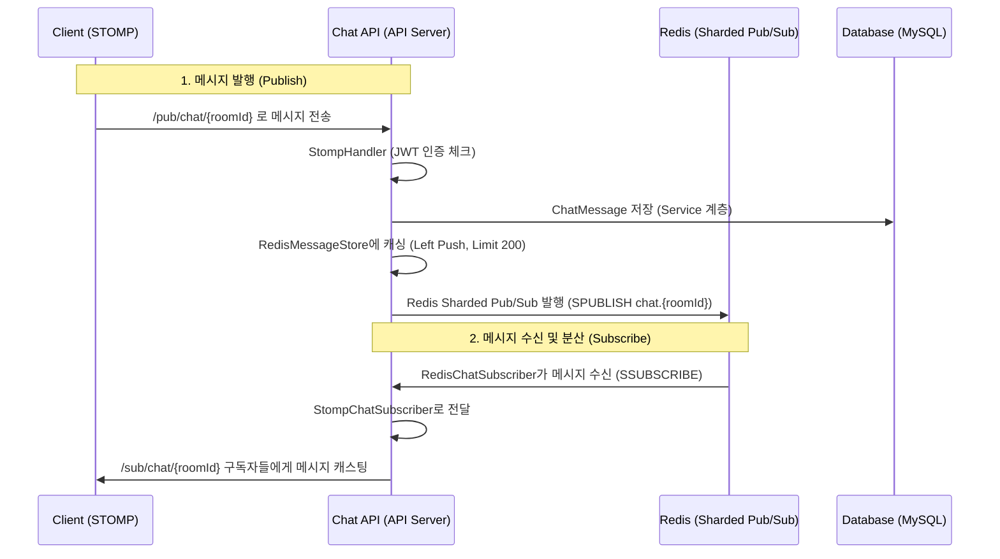

# 💬 채팅 시스템(Chatting) 상세 분석 및 기획

본 문서는 실시간 채팅의 메시지 흐름, Redis Pub/Sub 연동 구조, 현재 구현의 버그 및 개선 방향을 정의합니다.

## 1. 실시간 메시지 흐름 (Sequence Diagram)

## 2. 현재 구현의 핵심 문제점 (Problem Analysis)

### 2.1 치명적 버그: 직렬화 구분자 불일치
- **현상**: `RedisMessageStore`에서 저장 시 `|`(Pipe)를 사용하지만, 로드 후 파싱 시 `_`(Underscore)를 사용함.
- **영향**: 과거 메시지 조회(Paging) 요청 시 파싱 에러로 인해 전체 채팅 내역 조회 기능 작동 불가.

### 2.2 구독 매커니즘의 한계 (Multi-Instance Issue)
- **현상**: `RedisChatSubscriber`가 애플리케이션 시작 시 고정된 10개의 테스트 채널만 구독함.
- **영향**: 새로운 매칭 성사 시 생성된 채팅방의 메시지를 서버 인스턴스끼리 공유하지 못해, 다른 서버에 연결된 클라이언트에게 메시지가 전달되지 않음.

### 2.3 보안 취약점 (Security Loophole)
- **현상**: `StompHandler`에서 최초 `CONNECT` 시점에만 JWT를 검증함.
- **영향**: 권한 없는 사용자가 채팅방 ID를 추측하여 `/sub/chat/{roomId}`를 직접 구독하거나 메시지를 발행하는 것을 막을 수 없음.

### 2.4 캐시 조회 효율성 저하
- **현상**: Redis `List` 구조에서 커서 이후의 데이터를 가져올 때, 모든 데이터를 Java 힙 메모리로 가져와 애플리케이션 레벨에서 필터링함.
- **영향**: 채팅 데이터가 많아질수록(Cache Limit 200에 가까울수록) CPU 및 메모리 부하 증가.

## 3. 개선 방향 (Proposed Solutions)

- **직렬화 로직 보정**: `SERIALIZE_DELIMITER`를 고유한 단일 구분자로 통일하여 파싱 에러 수정.
- **동적 구독 시스템 도입**: 채팅방 입장 API 호출 시 또는 사용자 연결 시점에 `RedisChatSubscriber.subscribeRoom()`을 호출하여 해당 인스턴스가 수신할 채널을 실시간 업데이트.
- **STOMP 레벨 권한 검증**: `SUBSCRIBE`, `SEND` 프레임에 대해 인터셉터에서 해당 사용자가 `MatchingParticipant`인지 DB 또는 Redis 캐시를 통해 확인.
- **최적화**: `ZSET`을 이용한 타임스탬프 기반 커서 조회를 도입하여 Redis 엔진 레벨에서 페이징 처리 수행.

## 4. 3단계 검토 결과 (Verification Notes)
1. **흐름 검증**: 클라이언트 발송 -> API 서버 -> Redis 공유 -> 각 인스턴스 수신 -> 클라이언트 전송 흐름 확인 완료.
2. **누락 분석**: 채팅방 퇴장(Leave) 시의 세션 정리 및 Redis 구독 해지(UNSUBSCRIBE) 로직 확인 결과 현재 미구현 상태임.
3. **정합성 확인**: DB 저장과 Redis 발행 간의 일치성(Atomicity) 부족 확인, 향후 보상 로직 필요성 기록.
