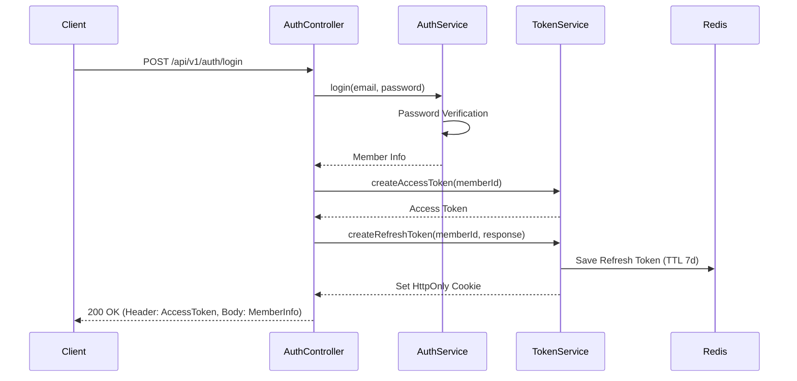
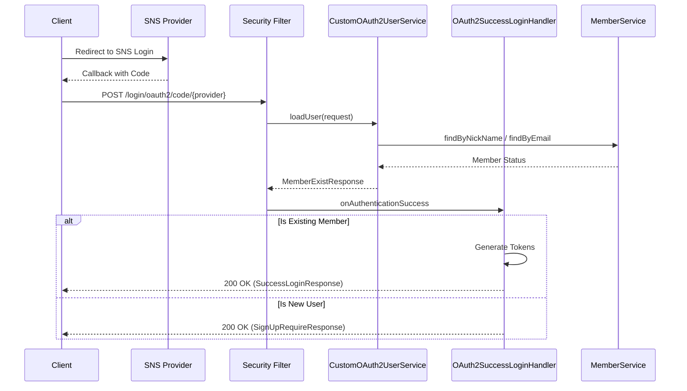

# 🔐 모각밥(Mokakbob) 로그인 및 인증 기획안

본 문서는 서비스의 회원가입, 로그인, 그리고 토큰 기반 인증 시스템의 상세 구조와 흐름을 정의합니다.

## 1. 인증 개요 (Authentication Overview)
- **방식**: JWT(JSON Web Token)를 활용한 무상태(Stateless) 기반 인증
- **전달 방식**:
    - **Access Token**: HTTP 헤더 `Authorization: Bearer {token}` 형식으로 전달
    - **Refresh Token**: `HttpOnly`, `Secure` 설정이 된 쿠키에 저장하여 보안 강화
- **보안 설정**: `SecurityConfig`를 통해 CSRF, 세션, 폼 로그인을 비활성화하고 JWT 필터를 통한 커스텀 인증 수행

## 2. 로그인 및 회원가입 (Login & Sign-up)

### 2.1 이메일 계정 기반 (Email/Password)
- **흐름**:
    1. 사용자가 이메일과 비밀번호로 로그인 요청 (`POST /api/v1/auth/login`)
    2. `AuthService`에서 `PasswordEncoder`를 사용해 비밀번호 검증
    3. 인증 성공 시 `TokenService`를 통해 Access/Refresh 토큰 발급 및 응답

### 2.2 소셜 로그인 (OAuth2)
- **현재 구현 상태**: GitHub 연동을 기반으로 구현되어 있음
- **동작 방식**: 
    1. `CustomOAuth2UserService`가 각 제공자로부터 사용자 정보를 로드 (이메일, 닉네임 등)
    2. 기존 회원 여부를 확인하여 `OAuth2SuccessLoginHandler`로 전달
    3. **기존 회원**: 즉시 토큰을 발급하고 로그인 성공 응답 반환
    4. **신규 회원**: 회원가입이 필요함을 알리는 응답(`SignUpRequireResponse`)과 함께 기본 프로필 정보 전달

## 3. 토큰 관리 정책 (Token Management)

### 3.1 토큰 사양
- **Access Token**: 짧은 유효 기간을 가지며 실제 자원 접근에 사용
- **Refresh Token**: 긴 유효 기간(기본 7일)을 가지며 Access Token 재발급 시 사용

### 3.2 저장 및 재발급
- **저장소**: Refresh Token은 Redis에 `memberId`를 키로 하여 저장 (중복 수동 로그아웃 처리 및 보안 대비)
- **재발급 흐름**:
    - `POST /api/v1/auth/reissue` 호출 시 쿠키에서 Refresh Token을 추출하여 검증
    - 유효할 경우 새로운 Access/Refresh 토큰 세트 발급 (Refresh Token Rotation 적용 가능)

## 4. 보안 가드레일 (Security Guardrails)
- **필터 체인 구성**:
    1. `ExceptionHandlingFilter`: 인증 과정에서 발생하는 예외를 공통 응답으로 변환
    2. `JwtAuthenticationFilter`: 요청 헤더의 JWT를 검증하고 `SecurityContext`에 인증 정보 설정
- **비밀번호**: BCrypt 해시 알고리즘을 사용하여 안전하게 암호화 저장

## 5. 향후 확장 계획
- Google, Kakao 등 다양한 OAuth2 제공자 추가 지원
- 2단계 인증(2FA) 또는 기기별 로그인 관리 기능 고려

---

## 6. 현재 구현의 문제점 및 개선 방향 (Analysis & Improvements)

전반적인 로그인 및 인증 로직을 검토한 결과, 다음과 같은 주요 개선 포인트가 확인되었습니다.

### 6.1 사용자 정보 추출 방식의 중복 (Redundancy)
- **현황**: `JwtAuthenticationFilter`에서 `SecurityContext` 설정과 동시에 `HttpServletRequest` 속성에 `memberId`를 중복 저장함. 커스텀 리졸버(`@MemberId`)는 이 요청 속성에 의존함.
- **문제점**: 데이터 소스가 이원화되어 관리 효율이 떨어지며, Spring Security 표준 메커니즘을 100% 활용하지 못함.
- **보안책**: `@MemberId` 리졸버가 `SecurityContextHolder`에서 직접 인증 객체를 추출하도록 변경하여 결합도를 낮추고 표준화함.

### 6.2 소셜 로그인 제공자 결합도 (Tightly Coupled OAuth2)
- **현황**: `CustomOAuth2UserService` 내부에 GitHub 특정 속성 키(`login`, `avatar_url`)가 하드코딩되어 있음.
- **문제점**: 새로운 소셜 로그인 제공자(구글, 카카오 등) 추가 시 핵심 서비스 코드를 계속 수정해야 함 (OCP 위반).
- **보안책**: `OAuth2UserInfo` 인터페이스를 도입하고 제공자별 구현체(Strategy 패턴)를 통해 속성 추출 로직을 분리 및 추상화함.

### 6.3 토큰 재발급 로직의 보안 (Security in Reissue)
- **현황**: Refresh Token의 유치 여부만 확인하고 단순 재발급 수행.
- **문제점**: Refresh Token 탈취 시 이를 감지하거나 전체 무효화할 수 있는 기제가 부족함.
- **보안책**: **Refresh Token Rotation (RTR)** 전략을 도입하여 재발급 시 기존 토큰을 폐기하고 새로운 쌍을 발급하며, 탈취 의심 시 Redis 내 해당 사용자의 모든 세션을 무효화함.

### 6.4 계정 열거 방어 (Account Enumeration Prevention)
- **현황**: "비밀번호 불일치"(`NOT_MATCH_PASSWORD`) 등 매우 구체적인 인증 실패 에러 반환.
- **문제점**: 공격자가 특정 이메일의 가입 여부를 유추하는 데 활용될 수 있음.
- **보안책**: 인증 실패 시 아이디 존재 여부와 무관하게 "아이디 또는 비밀번호가 잘못되었습니다"와 같은 통합 메시지를 제공하도록 개선 권장.
