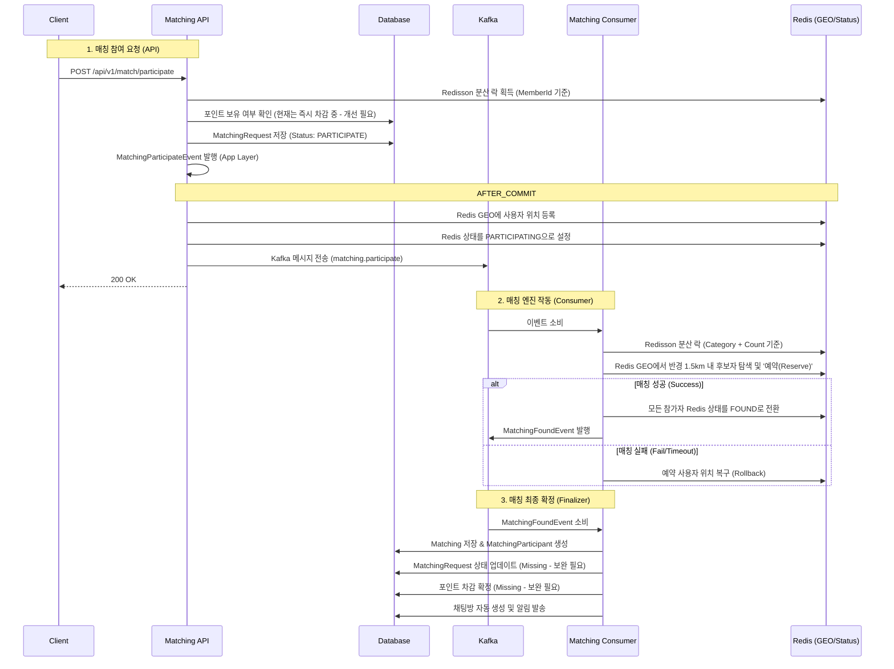

# 🍱 매칭 시스템(Matching) 상세 기획 및 분석 (보강)

본 문서는 사용자의 매칭 요청부터 성사까지의 흐름, 현재 구현의 한계점 및 개선 방향을 정의합니다.

## 1. 매칭 프로세스 흐름 (상세 흐름도)

## 2. 현재 구현의 핵심 문제점 (Deep Analysis)

### 2.1 매칭 요청 상태 유실 (State Management Issue)
- **현상**: `MatchingRequest` 엔티티가 `PARTICIPATE` 상태로 생성된 후, 매칭이 성사되어도 `MATCHED` 또는 `COMPLETED`로 업데이트되지 않음.
- **여파**: 사용자의 매칭 이력 관리가 불가능하며, 관리자 페이지 등에서 현재 매칭 현황을 정확히 파악할 수 없음.

### 2.2 포인트 정책 위반 및 금전적 위험 (Point Risk)
- **현상**: 매칭이 성사되지 않았음에도 API 요청 시점에 포인트를 선차감함.
- **여파**: 매칭 실패 시 포인트가 반환되지 않아 금전적 손실 발생. 기획안의 "매칭 성사 시 차감" 정책과 정면 배치됨.

### 2.3 분산 시스템 정합성 문제 (Distributed Consistency)
- **현상**: Redis 상태 변경(GEO 삭제 등)과 DB 트랜잭션이 분리되어 있음.
- **여파**: Consumer 장애나 DB 예외 발생 시, Redis에는 '매칭 완료'로 표시되어 있으나 DB에는 매칭 정보가 없는 '유령 데이터' 상태가 발생할 수 있음.

### 2.4 매칭 알고리즘의 유연성 부족
- **반경 설정**: `RADIUS_METERS = 1500.0`으로 고정되어 있음. (도보 15분 정책 대비 넓음)
- **병목 지점**: 카테고리 중심의 분산 락으로 인해 특정 인기 메뉴(예: 치킨) 요청 시 전국 단위의 사용자가 순차적으로 매칭 대기열에 진입함.

## 3. 기술적 보완책 (Proposed Fixes)

1. **상태 동기화 로직 추가**: `MatchingFoundService` 내에서 `MatchingRequest`를 찾아 상태를 변경하는 로직 반드시 추가.
2. **포인트 차감 시점 조정**: 
   - API: 포인트 보유 여부만 체크.
   - MatchingFoundService: 실제 성사 시점에 `Member.deductPoint()` 실행. 
3. **Redis 조작 원자성 확보**: 
   - Lua Script를 사용하여 후보자 탐색과 가용성 체크(Reservation)를 원자적으로 처리.
4. **Geohash 기반 락 세분화**: 
   - `lock:matching:{category}:{geohash}` 형태로 변경하여 지역별 병렬 매칭 가능하도록 개선.
5. **보상 트랜잭션 정의**: 
   - 매칭 실패/취소 시 Redis 상태를 원복하는 로직과 포인트 환불(선차감 유지 시) 로직 명확화.
